# NadaiFlight External Adapter Chainlink 

Esta repo es una guia del tutorial de Chainlink sobre `External Adapters` para la comunidad hispano hablante. Esta demostración muestra cómo construir un external adapter que se conecta a un nodo Oracle de Chainlink para que sus contratos inteligentes puedan obtener datos arbitrarios de una API externa. 

En este caso veremos como un vuelo con 300 pasajeros deja una mancha en el ozono. Verificaremos por oráculos de Chainlink y escribiremos en la Blockchain cuanto ha sido su consumo llamando a la Api, siendo estos datos de unas carateristicas inmutables ` por naturaleza de la BLock`, pudiendo verificar siempre su estado inaltereable y con él, los cambios de emisiones de `CO2` por vuelo. 

## Arquitectura

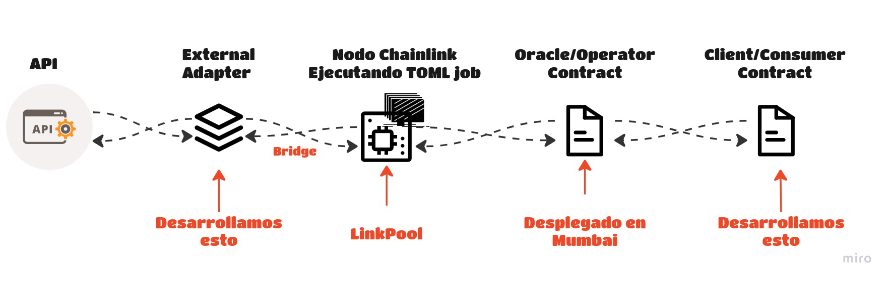
### Hipotético casos de uso

Las regulaciones han puesto pie en el asunto. A partir del próximo mes los gastos de CO2 serán gestionados por Smart contract en la Blockchain, las compañias depositarán unos Fondos de Garantias para cubrir legislación. Dependiendo de la emisión final podremos optar a:

* CO2 % Encima de normativa = Sanción de X usdt, autopagable de Fondos Garatía CO2 en la medición final del mes.

* CO2 % Medio de normativa = Sin sanción ni bonificación, autopagable de Fondos Garatía CO2 en la medición final del mes.

* CO2 % Bajo de normativa = Bonificación de X usdt, autopagable de Fondos Garatía CO2 en la medición final del mes.

Como vemos este simple caso de uso haria que esta tecnología sea inmutable, trasnparente y auditable por cualquiera.

### Documentos externos oficiales

Aquí estarán todos los enlaces oficiales, herramientas y documentos usados para este Workshop.

* [Workshop External Adapters 📹](https://www.youtube.com/watch?v=fs3Xg3fZ2Sg)
* [Gilbert Oficial](https://github.com/teterabOb/cl-ea-linkpool-workshop) Repositorio Github oficial del Workshop
* [External Adapters](https://docs.chain.link/docs/external-adapters/) 
* [Chainlink NodeJS External Adapter](https://github.com/thodges-gh/CL-EA-NodeJS-Template.git)Está basado en este Template.La plantilla proporciona un marco básico para desarrollar adaptadores externos de Chainlink en NodeJS.
* [Api Climatiq](https://www.climatiq.io/). Utilice su API REST distribuida globalmente con aplicaciones que se ejecutan en cualquier dispositivo o servidor ubicado en cualquier centro de datos. Integre inteligencia de emisiones de carbono en sus aplicaciones.
* [Climatiq Doc](https://www.climatiq.io/docs)
* [Sección de Vuelos](https://www.climatiq.io/docs#travel-flights) Además del cálculo directo de las emisiones por pasajero-kilómetro, pasajero-milla, tonelada-kilómetro o tonelada-milla, Climatiq pone a disposición puntos finales para calcular las emisiones en función de los aeropuertos de salida y llegada. La API seleccionará automáticamente un factor de emisión, actualmente basado en la elección del valor de CO2e más alto disponible.

---

## Crear su propio adaptador a partir de esta plantilla

Primero clonaremos este repositorio y cambiar `ExternalAdapterProject` abajo al nombre de su proyecto, en este caso por `NadaiExternalAdapterProject`

```bash
git clone https://github.com/thodges-gh/CL-EA-NodeJS-Template.git ExternalAdapterProject
```

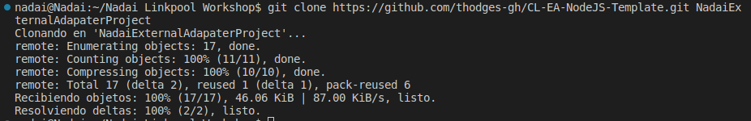

Entra al nuevo directorio creado

```bash
cd ExternalAdapterProject
```

Puedes remover el historial repositorio de git ejecutando:

```bash
rm -rf .git
```

## Instalar localmente

Instalar dependencias:

```bash
yarn
```

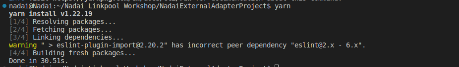

### Run

Correr la aplicación de manera local (por defecto en el puerto 8080)

```bash
yarn start
```

**NOTA: Una vez se ejecute el nodo, no cerrar TERMINAL, abrir una nueva para continuar pruebas**

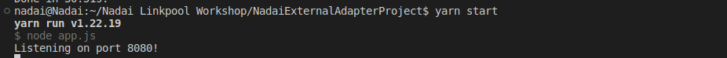

---
## Climatiq

Una vez registrado en [Climatiq](https://www.climatiq.io/) necesitaremos guardar en `.env.example` los `API_KEY` y `API_POINT`. Iremos a `API Keys` y crearemos una con el nombre que queramos, esta api la pegaremos en el archivo `.env.example`.

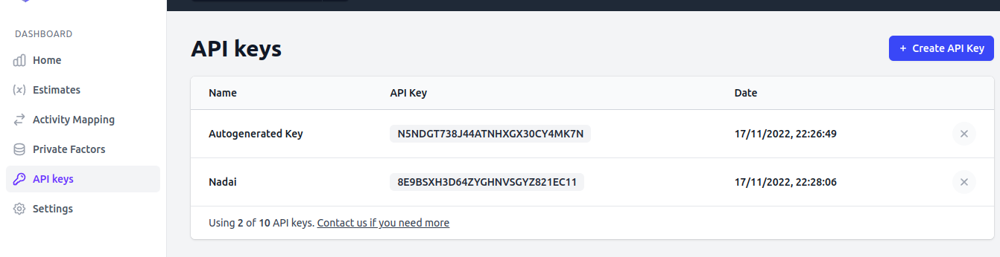


El `API_POINT` Calcula las emisiones totales estimadas producidas por los vuelos de pasajeros entre los aeropuertos especificados. Lo obtendremos de los [documentos](https://www.climatiq.io/docs#travel-flightsx)

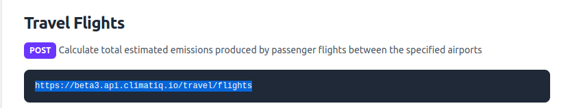


Quedando el archivo [.env.example](/.env.example) de la siguiente forma

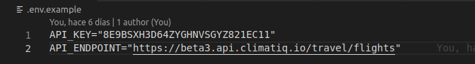 

---

## DigitalOcean

DigitalOcean tiene los servicios de computación en la nube que necesita, con precios predecibles, documentación sólida y escalabilidad para respaldar su crecimiento en cualquier etapa. Iremos a [DigitalOcean](https://www.digitalocean.com/) para hacer nuestro registro, en nuestro caso conectamos con Github y luego procedimos a la verficación. 

Aqui deberemos de `Verificar su identidad` y de pagar `5 USD` con un método de verificación centralizada, en este caso usamos `Paypal`. Una vez verficado y realizados estos pasos podremos seguir, desbloqueando el menu principal.

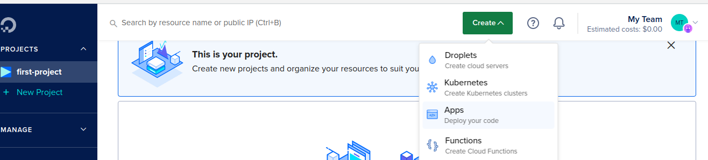 

En digital iremos a `Create` y escogeremos `Apps`. Dentro podremos configurar con un par de click, que repo escoger sin tener que definir mas valores manuales, para ello ajustaremos `Manage account` y daremos permisos desde `Github`.

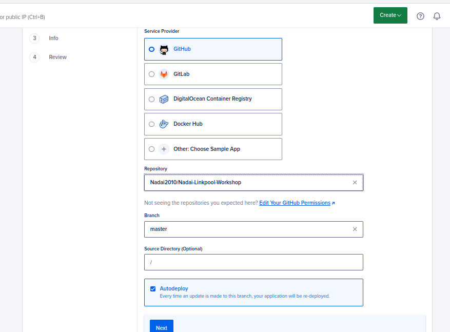 

**NOTA: Para ver el repositorio actual, cargue previamente su contenido mediante un Fork o Manual de este repositorio**


Ahora iremos a recursos y ajustaremos al `Plan Básico` de `5usd` y el resto lo dejaremos igual, revisar foto

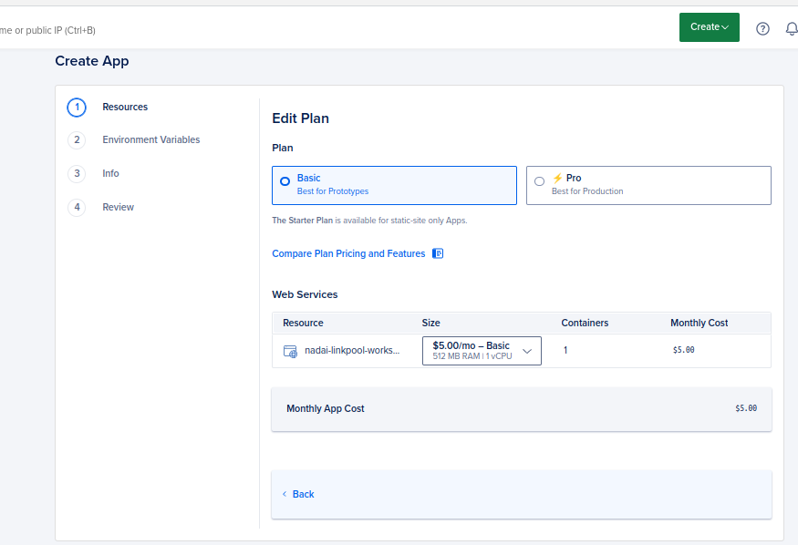 


Ahora iremos a los ajustes de las variables del entorno y le daremos a `Editar`, tendremos que tener los datos de `API_POINT` y `API_ENDPOINT`. Añadiremos dos `Keys` con estos valores y guardamos los ajustes, veremos como han sido añadidos ambos y le damos a siguiente. 

Los siguientes dos pasos puede darle a continuar hasta que se cree su proyecto. Luego empezará su creación esto le llevará algún tiempo. Una vez termine dará un nombre aleatorio a su proyecto, en este caso `seashell-app`.

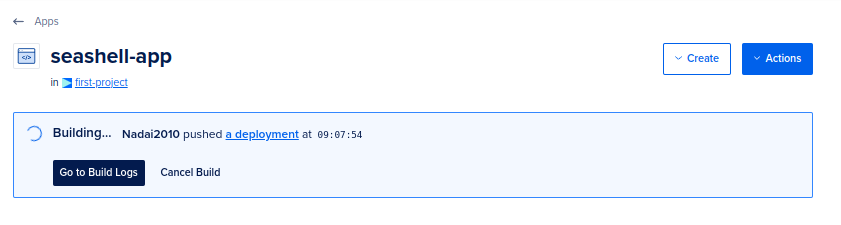   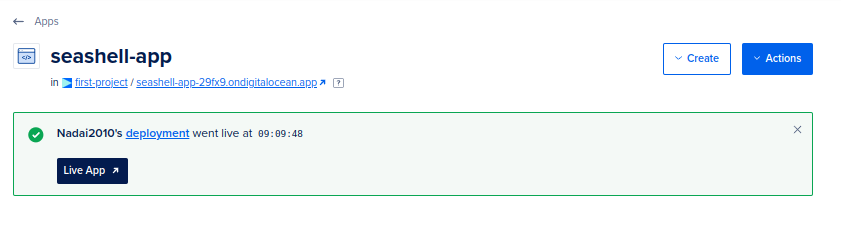 
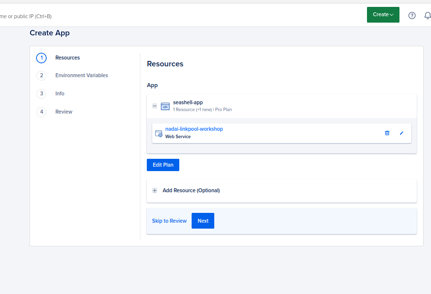 

Ahora tendremos que darle al enlace de ir `https://seashell-app-29fx9.ondigitalocean.app/`

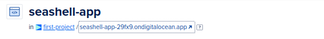     

No se preocupe por el error, solo nos hace falta `https://seashell-app-29fx9.ondigitalocean.app/`
para modificar el código que vamos a usar en la terminal y sustituir el `API_ENDPOINT`. Inicialmente usariamos el primero en la terminal con el nodo abierto, y ya con el `API_ENDPOINT` el segundo.

```bash
curl -X POST -H "content-type:application/json" "API_ENDPOINT" --data '{"id": 1, "data": {"from": "ONT", "to": "SCL","passengers": 300,"classFlight": "unknown" } }'
```

Quedando el definitivo en esta repo asi y la que ejecutaremos en la terminal que dejamos el nodo abierto.

```bash
curl -X POST -H "content-type:application/json" "https://seashell-app-29fx9.ondigitalocean.app/" --data '{"id": 1, "data": {"from": "ONT", "to": "SCL","passengers": 300,"classFlight": "unknown" } }'
```

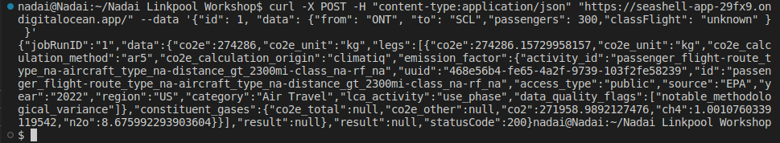 

Puede revisar también en [Digital Ocean](https://www.digitalocean.com/) como su terminal le devuelve los mismo datos solicitados.

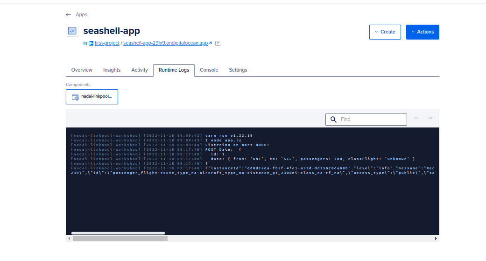 


NOTA: RECUERDE EN CASO DE DUDA [Workshop External Adapters 📹](https://www.youtube.com/watch?v=fs3Xg3fZ2Sg)

---
## LinkPool & NaasLink

Ahora nos centraremos en una de las partes mas importantes LinkPool. Son creadores de nodos en los que puede confiar, creando productos y servicios diseñados específicamente para proveedores de datos, desarrolladores, participantes y operadores.

* [LinkPool](https://linkpool.io/)
* [LinkPool Documentos](https://docs.linkpool.io/docs/overview)
* [NaasLink](https://naas.link/)

Entraremos en [NaasLink](https://naas.link/) para crear soluciones y enviarlas más rápidas al abstraer las complejidades de la infraestructura con los nodos bajo demanda centrados en el desarrollador de LinkPool.

Le daremos a conectar `web3`, debemos tener Metamask instalado y configurado en Munmbai o Goerli, para este Workshop. 

Al darle a conectar tenemos que estar en `RED ETH` sino dará error, una vez firmado el mesaje su cuenta habrá sido creada.

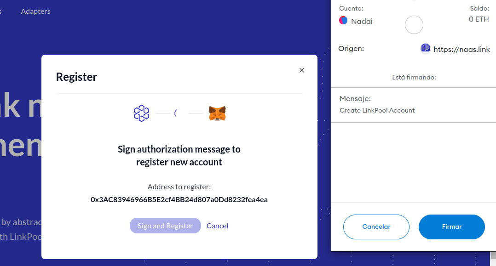 
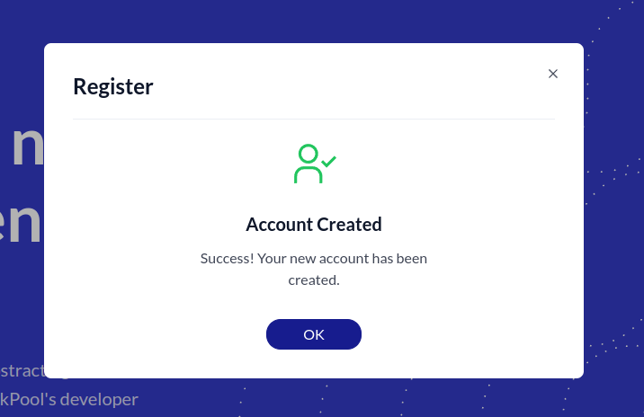 

Luego iremos `Your Deployoments` y nos saldrá todos los nodos o external adaptadores disponibles, asi como toda la información de cada uno de ellos como proveedor de datos. En nuestro caso iremos a `Nodos` para deployar el nodo `Chainlink Goerli Testnet`, para hacerlo en una red disitnta al tutorial oficial, asi abarcamos más contenido, en ella nos dará datos IMPORTANTES a guardar.

* Password y dirección del Dominio
* Password y dirección del Nodo 

Una vez pasados unos minutos podremos darle a `Operator` el cual nos pedirá el `Domain login` y `Password` y posterior los del `Nodo`. Si todo ha ido bien se les abrirá sus Dashboard de Chainlink Operator

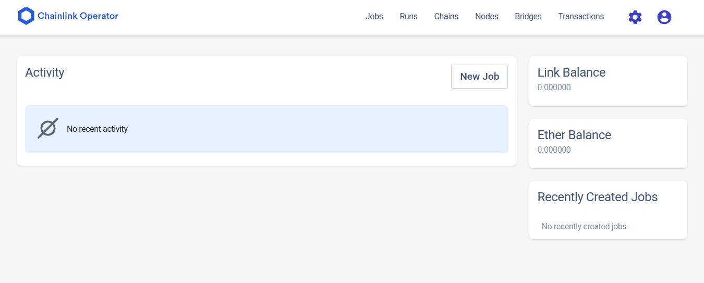 

---
### Bridge entre Nodo Chainlink y External Adapter

Ahora iremos a la sección de `Bridges` y le daremos a `New Bridge`. Añadiremos el nombre que queramos y en `Bridge URL*` pondremos la dirección que nos aportó Digital Ocean (https://seashell-app-29fx9.ondigitalocean.app/), el resto lo dejamos igual.

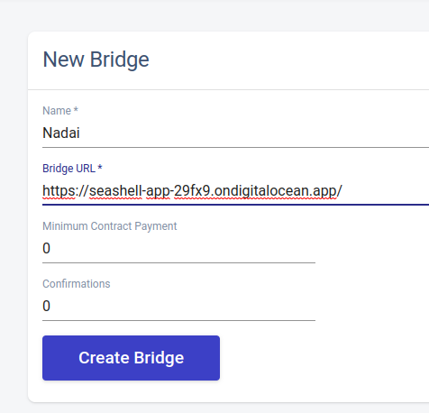 
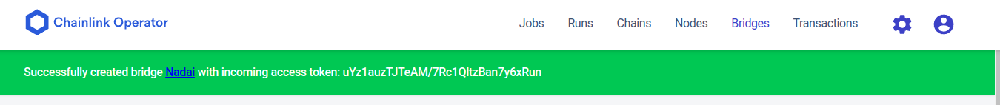 

---
### Jobs 

Ahora que se ha creado el bridge, iremos a la sección `Jobs` y `new jobs` y pegaremos el archivo ya generado [climateq-ea.example.toml](/job-spec/climateq-ea.example.toml) pero este archivo debe de ser modificado con la direción de [Oracle.sol](https://docs.chain.link/chainlink-nodes/fulfilling-requests), aquí encontraremos el Smart que deployaremos en Remix y nos servirá para ajustar el `Jobs`

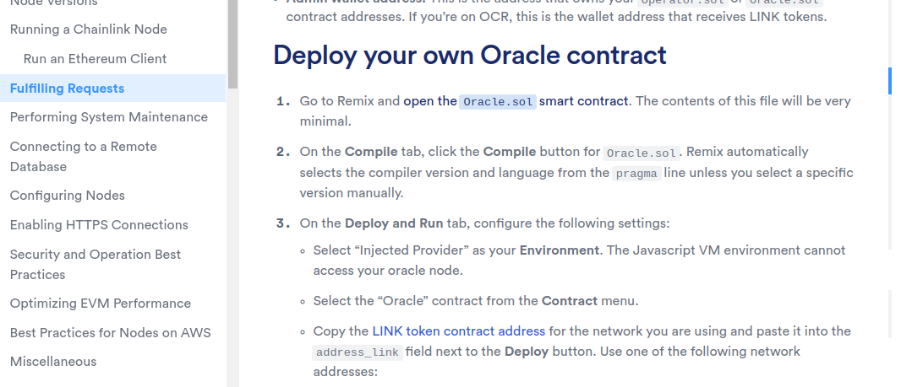 

---

#### Remix Oracle.sol

El enlace le llevará directamente a Remix con [Oracle.sol](https://docs.chain.link/chainlink-nodes/fulfilling-requests), para ello valla hasta `open Oracle.sol Smart Contract`, deberá de ajustar la versión de compile a `0.6.6`

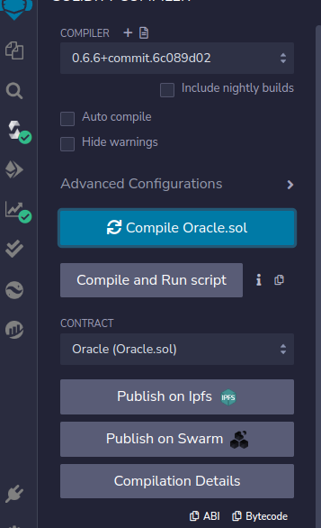 

Ahora procederemos a conectar nuestro `ENVIRONMENT` en `Injected Metamask` y haremos el deploy en el que debemos añadir la dirección de Smart de [LINK TOKEN](https://docs.chain.link/resources/link-token-contracts/) de la red escogida. 

* Puede conseguir [Faucet GoETH](https://goerlifaucet.com/)
* Puede conseguir [Faucet GoETH](https://goerli-faucet.mudit.blog/)
* Puede conseguir [Faucet Matic](https://faucet.polygon.technology/)
* Puede conseguir [Faucet Link](https://faucets.chain.link/)

Copiaremos la dirección de Link Token de Testnet Goerli y la pegaremos en Remix para el Deploy

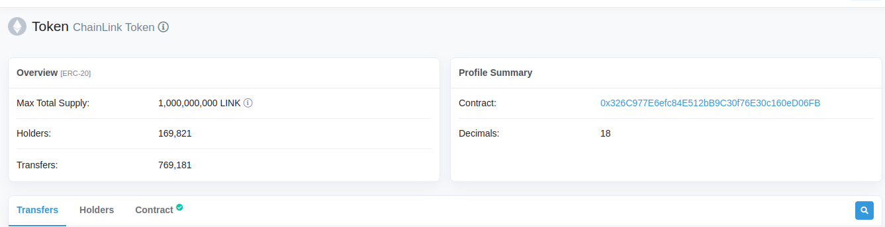 
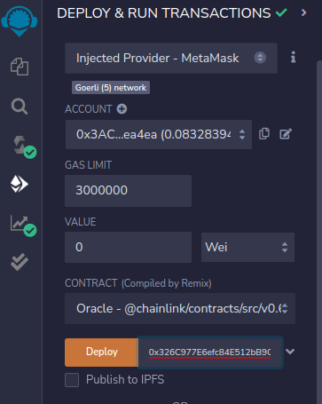

* [HASH](https://goerli.etherscan.io/tx/0xab0648169335123db3a6a234fd51449a662ac7b668428da82a49f8171e1104ee)

NOTA: Este contrato estará verificado en Etherscan, por lo que podrá actuar directamente desde el explorador.

Ahora podremos actuar desde Remix o Goerli Etherscan, en este caso con [Oracle](https://goerli.etherscan.io/address/0x3cad6eec66c02dd6042af12076c67a9916034d63#writeContract) que hemos creado. 

Primero necesiteremos algunos datos de [ChainLink Operator](https://naas.link/),en nuestro nodo en `Manage node` entraremos y luego en el apartado `Operator` Nos volverá a pedir credenciales e iremos a `ajustes` y `Key Management` que nos proporcionara varias claves. Nos hara la falta `Account Addresses`

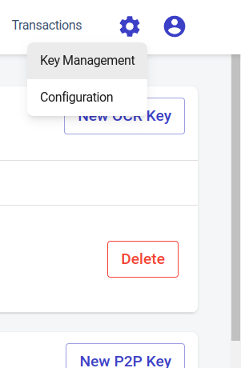

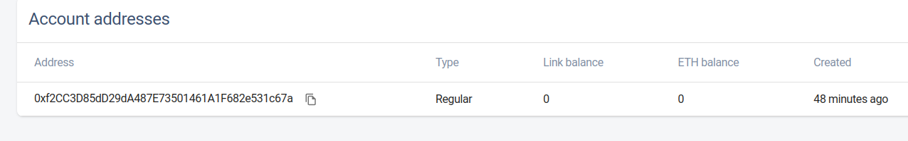


Ahora iremos a [Explorador y Oracle](https://goerli.etherscan.io/address/0x3cad6eec66c02dd6042af12076c67a9916034d63#writeContract#F5) en la opción  `setfullimentPermission` pegaremos nuestra `Account Addresses` y `true`.

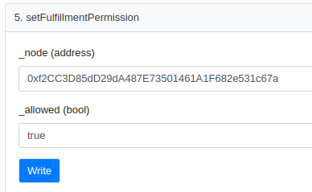

* [Hash](https://goerli.etherscan.io/tx/0x25a91d71bfc45560b991bfacdd7b058c772afcbdac84568a46642e0b38df058c)

Por ahora dejaremos el `Account Addresses` sin saldo de `GoEth` ni `Link`, pero para que funcione al final de los ajustes deberemos cargarlo para que confirme las llamadas, pero antes volvamos a `Jobs`

---

## Ajustes Jobs

Ahora copiaremos la dirección del conrato que ha deployado en nuestro caso [NadaiOracle](https://goerli.etherscan.io/address/0x3cad6eec66c02dd6042af12076c67a9916034d63) y lo añadiremos en el [climateq-ea.example.toml](/job-spec/climateq-ea.example.toml), sustituyendo `ORACLE_CONTRACT_ADDRESS` y el `BRIDGE_NAME` por el que haya escogido, nosotros `Nadai`, esto siempre desde [NaasLink](https://naas.link/), aunque puede hacer los ajustes desde su editor de codigo en el archivo.

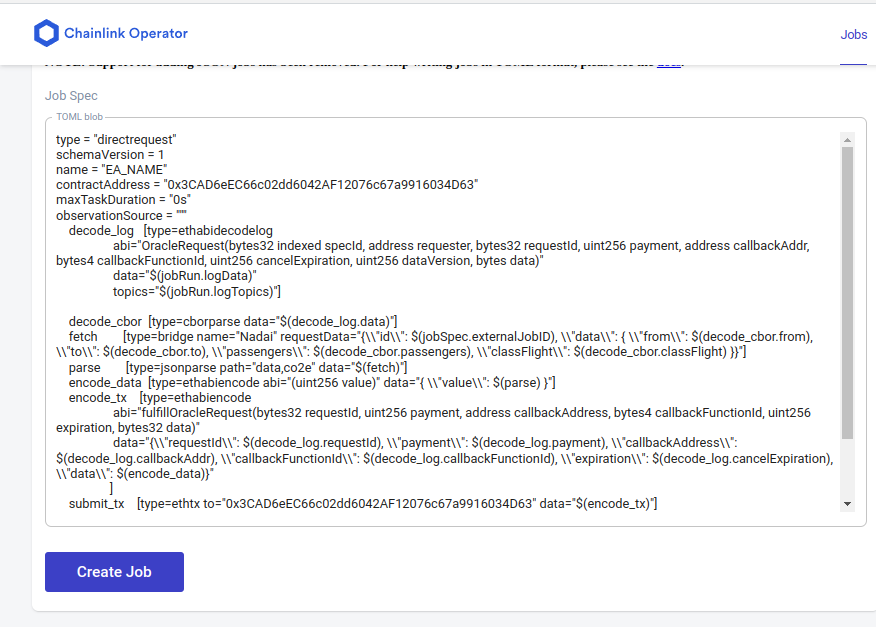
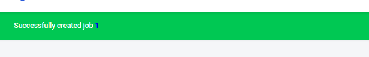

Esto nos dará si todo ha ido bien una ID y el `External Job ID` que nos hará falta para el siguiente contrato [Co2Consumer.sol](/contracts/Co2Consumer.sol).

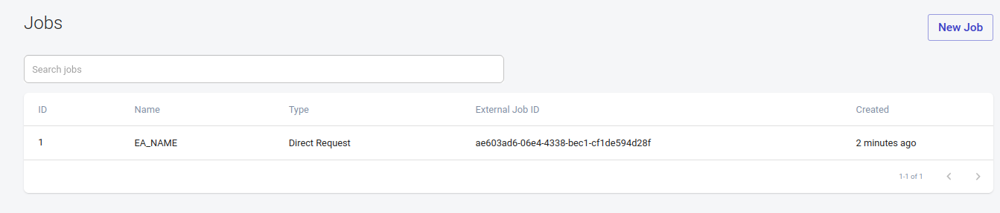

## Remix Co2Consumer.sol

Ahora pasaremos a copiar [Co2Consumer.sol](contracts/Co2Consumer.sol) y hacer el `compile` y `deploy` en [Remix](https://remix.ethereum.org/)

Primero haremos el `compile`, fijarse dejar la versión en la adecuada, en este caso `0.8.7`.
Tambien deberemos sustituir en el contrato los siguientes valores antes del `deploy`

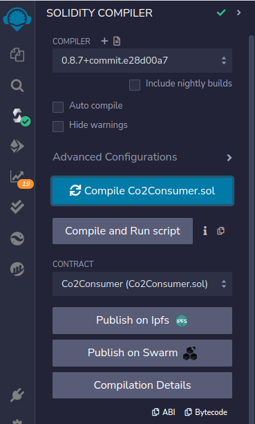

* [Dirección de Contrato token Link Goerli](https://goerli.etherscan.io/token/0x326C977E6efc84E512bB9C30f76E30c160eD06FB)
* [Contract Address de Oracle](https://goerli.etherscan.io/address/0x3cad6eec66c02dd6042af12076c67a9916034d63)
imagen
* [External Key del Job ID sin guiones Operator](https://cdrl6mbafsvkuk9gp1ug.eu-west1.naas.linkpool.io/signin)


* [HASH](https://goerli.etherscan.io/tx/0xeb2c0dade4468c2070822c31f395f593571d3fe0b02fe539c3051b5790c3ff7a)

Ahora le ENVIAREMOS Link a este Smart deployado para que pueda ejecutarse. Luego usaremos REMIX para escribir directamente, ya que verificar el contrato lleva mas trabajo. Iremos a `requestCO2emission` y añadiremos los datos iniciales, revise foto.

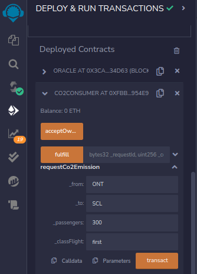

* [HASH](https://goerli.etherscan.io/tx/0x8380edafabd24489388d2e502235133fca162872874510c3cae2c39f9b063188)


## Verificar que está Run

Ahora si todo ha ido bien deberiamos de recibir una solitud en nuestro `Operator` [NaasLink](https://naas.link/) y como se estaría ejcutando

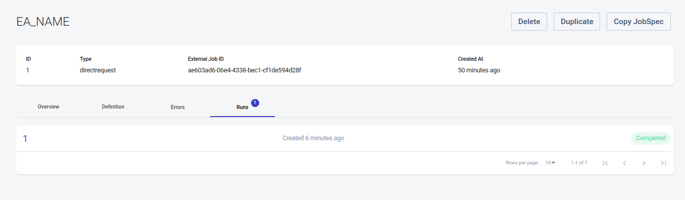

También veremos ahora dentro de las `Transactions` que se ha ejecutado una, pero si entramos comprobariamos que esta en estado `pendiente`. Esto es debido ha que la `Account Addresses` debe de recibir fondos para poder `confirmar` las transacción. Asi que procedemos a enviarle `0.01 ETH` para poder confirmar la tx.

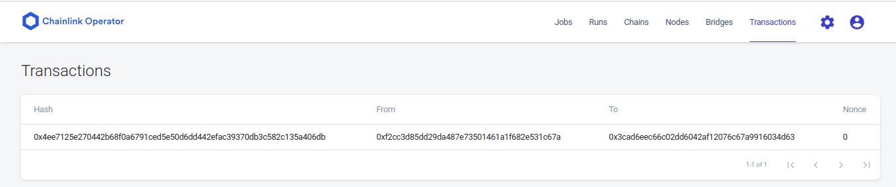

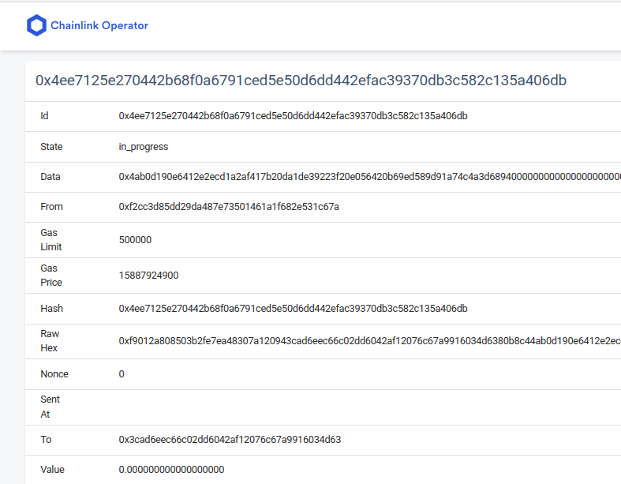


Una vez llegados los fondos veremos como cambia el estado de la transacción y como se verificaria todo en nuestro contrato de Consumidor dentro de la Blockchain.

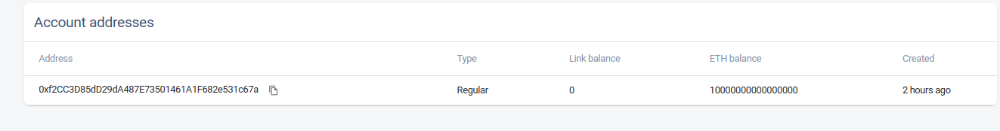

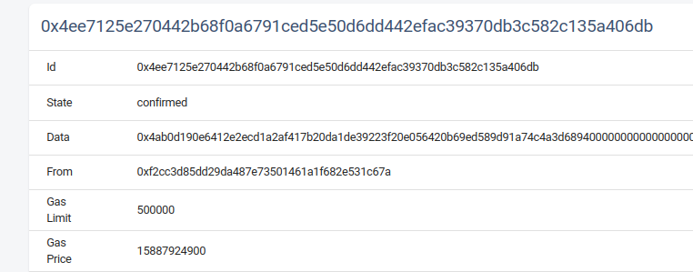

---
## Conclusión

Antes que nada agredecer el esfuerzo a Chainlink y su comunidad por hacer estos Workshop tan importantes y bien explicados. En este caso hemos aprendido a crear un External Adapter desde el nodo de Chainlink para ofrecer unos datos desde fuera de la cadena hacia dentro de la cadena. Aprendimos ajustar nuestras API, API_KEy...Para que nuestros contratos de Consumidor creados, inmutables, auditables puedan hacer esa llamada siempre solitando el External Adapter, no quedando expuesto la  información sensible de la API.
